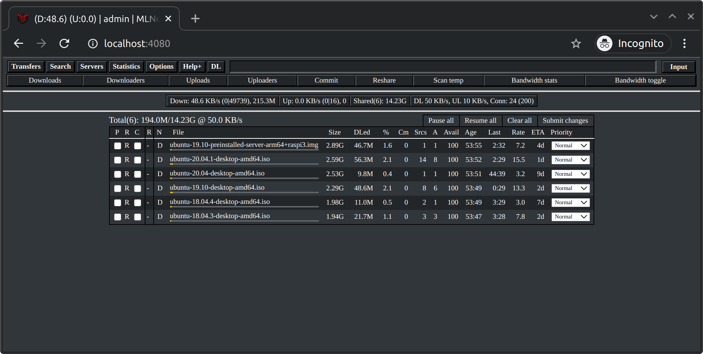

# mldonkey docker image

This repository host the Dockerfile for building mldonkey docker image.



## Usage

To run mldonkey using this image:

```
$ docker run -i -t cheungpat/mldonkey
```

You may change the admin password by using the comand `useradd admin <password`,
or you can specify `MLDONKEY_ADMIN_PASSWORD` environment variable with
a password:

```
$ docker run -i -t -e MLDONKEY_ADMIN_PASSWORD=supersecret cheungpat/mldonkey
```

mldonkey stores data inside `/var/lib/mldonkey`. You may want to mount the
data directory to local filesystem. Doing this will persist the data
when you re-create the docker container. It is also easier to get downloaded
files this way.

```
$ docker run -i -t -v "`pwd`/data:/var/lib/mldonkey" cheungpat/mldonkey
```

Your data will be available under `data/incoming` directory where you
run the `docker run` command.

## Owner and permissions

The mldonkey daemon running inside the container must be able to read and modify
data inside the volume. You'll also probably want to properly share data with a
user available in your host. The mldonkey daemon always use the **mldonkey** user and
group, but you can setup the environment so that the container assignes the desired
uid and gid to the mldonkey user and group inside the container. This will allow you
to see those files with the proper permissions in your host.

### Example

Let's assume your user is named _luca_ and has the uid 1001, and that you want your
data to be assigned group _luca_, which has the same gid 1001. In this case you
can ask the container to assign the value 1001 to uid and gid _mldonkey_ in the container
by using the env variables:

```
MLDONKEY_UID=1001
MLDONKEY_GID=1001
```

This will establish a mapping between user _luca_ in the host to user _mldonkey_ in the
container, and group _luca_ in the host with group _mldonkey_ in the container.


## Notes for Docker for Mac

mldonkey does not like the `temp` directory to reside in Mac filesystem. It is
better to mount `/var/lib/mldonkey/temp` inside the Docker VM filesystem.

The included `docker-compose.yml` set up everything for you. To run in Docker
for Mac,

```
$ docker-compose up
```
